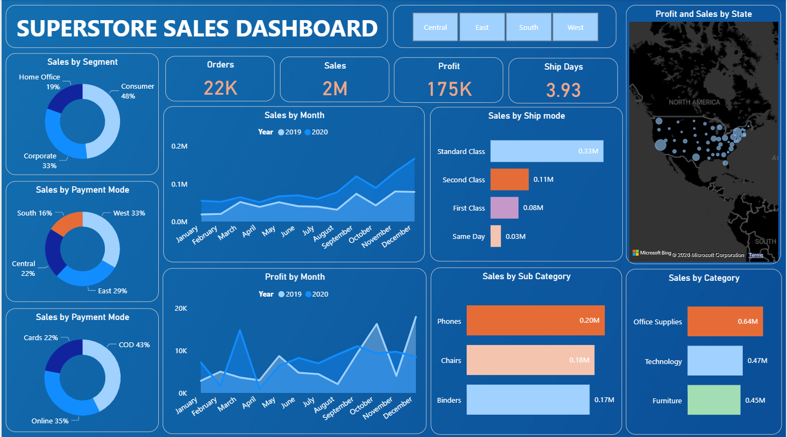
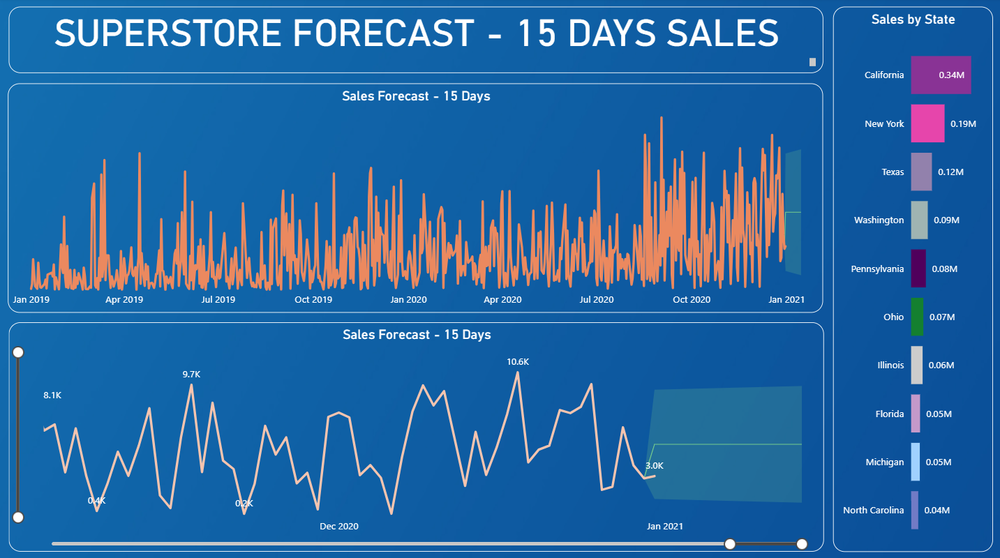

# Superstore Sales Dashboard (Power BI)

## Overview
This project presents an interactive Sales Dashboard built using Power BI to analyze Superstore data. The dashboard provides insights into sales performance, profit trends, customer segments, and regional analysis to support data-driven decision-making.

## Objectives
- Analyze overall sales and profit performance  
- Identify top-performing products and categories  
- Track regional and segment-wise sales trends  
- Provide actionable insights through visualization  

## Tools Used
- Power BI  
- Excel (data source)  
- Data Visualization  

## Key Features
- Interactive filters and slicers  
- Region-wise and category-wise analysis  
- Profit vs Sales comparison  
- Trend analysis over time  
- Dynamic visuals  

## Key Insights
- Identified high-performing regions contributing maximum revenue  
- Highlighted product categories with low profit margins  
- Observed sales trends across different customer segments  
- Found opportunities to improve profitability  

## How to Use
1. Download the `.pbix` file  
2. Open in Power BI Desktop  
3. Use filters to explore insights  

## Dashboard Preview

